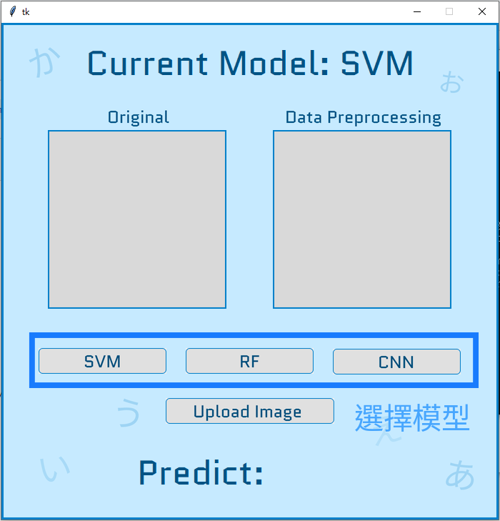
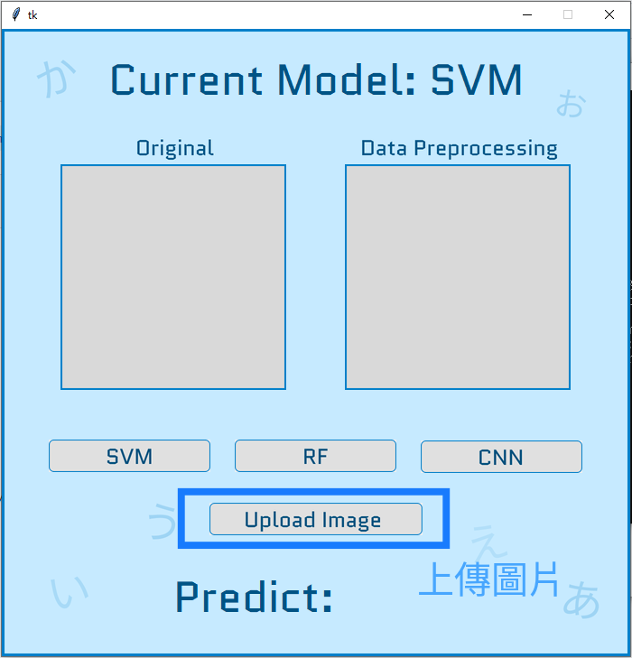
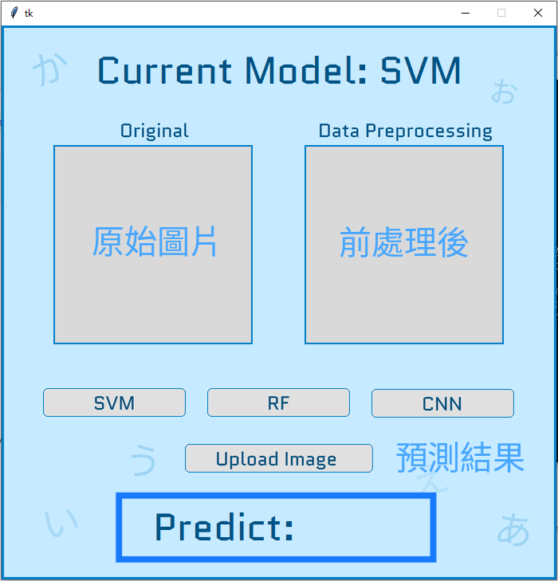

# Machine-Learning-final-project
## 環境安裝
輸入以下指令來安裝環境和套件，env_name為自訂環境名稱
```cpp=
conda create --name {env_name} python=3.9
conda activate {env_name} 
pip install -r requirements.txt
```

## 下載模型
到下面連結下載模型，並解壓縮到同一個資料夾中
https://drive.google.com/file/d/1lF4Mgre7a3qPcD-8ndAbekMPrRmwl-Yu/view?usp=drive_link

## GUI使用說明
1. 輸入以下指令到UI資料夾，並執行程式碼，即可看到介面。
```cpp=
cd UI
python gui.py
```

2. 介面上有三個按鈕可以選擇模型。<br>


3. 按下Upload Image按鈕可以上傳圖片。<br>


4. 上傳完後，介面上會顯示原始圖片、前處理後的圖片和預測結果。<br>

